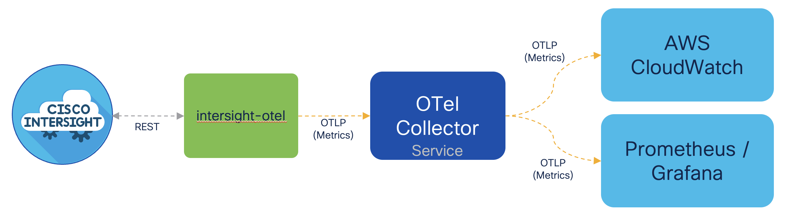
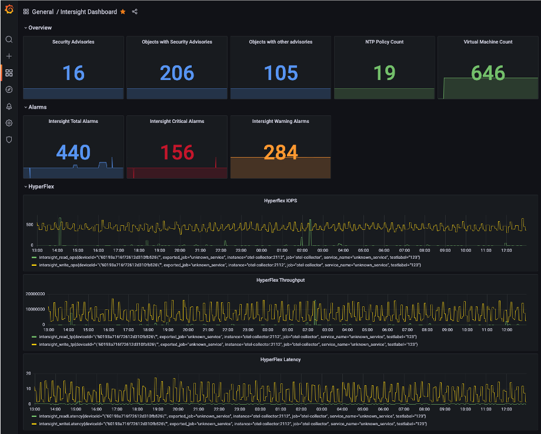
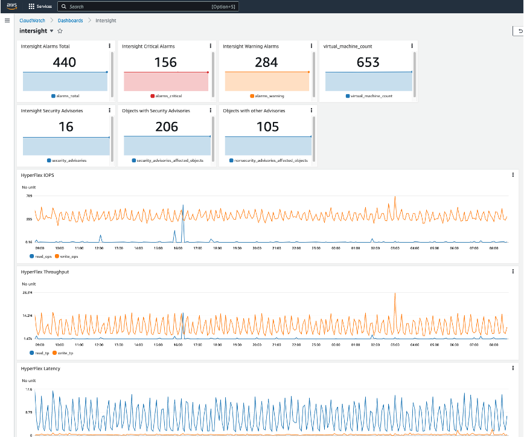
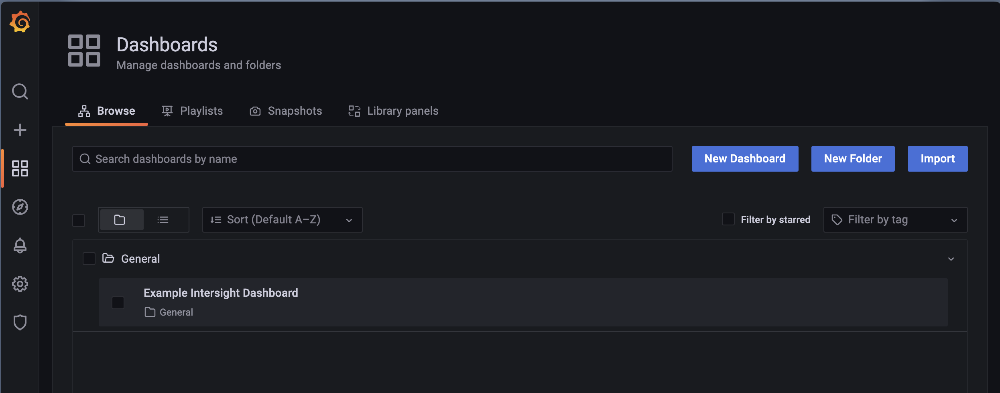

# intersight-otel - generate OpenTelemetry metrics from Cisco Intersight API calls

`intersight-otel` is a tool to make Cisco Intersight API requests and generate OpenTelemetry metrics from the responses. 

The use case for this is to feed statistics about an Intersight managed environment into other monitoring and dashboarding tools such as Prometheus/Grafana, AWS Cloudwatch, etc. By generate OpenTelemetry metrics, the [otel-collector](https://opentelemetry.io/docs/collector/) can be used to export the metrics into a variety of [different backends](https://github.com/open-telemetry/opentelemetry-collector-contrib/tree/main/exporter):







# Usage

The simplest way to try `intersight-otel` is to deploy the example onto a Kubernetes cluster. This will deploy a preconfigured `intersight-otel` agent, a Prometheus server and a Grafana server. All you need to provide is your Intersight API key.

First, create a new namespace for the demo:
```
$ kubectl create namespace intersight-otel
namespace/intersight-otel created
```

Add your Intersight API key as a Kubernetes secret. This assumes you have your Intersight Key ID in `/tmp/intersight.keyid.txt` and your Intersight Key in `/tmp/intersight.pem`:
```
$ kubectl -n intersight-otel create secret generic intersight-api-credentials --from-file=intersight-key-id=/tmp/intersight.keyid.txt --from-file=intersight-key=/tmp/intersight.pem
secret/intersight-api-credentials created
```

Finally, apply the example manifest:
```
$ kubectl -n intersight-otel apply -f https://github.com/cgascoig/intersight-otel/raw/main/examples/kubernetes/all-in-one.yaml
deployment.apps/intersight-otel created
configmap/intersight-otel-config created
service/otel-collector created
configmap/otel-collector-config created
configmap/prometheus-config created
statefulset.apps/prometheus created
service/prometheus created
deployment.apps/grafana created
configmap/grafana-datasources created
configmap/grafana-dashboards-provider created
configmap/grafana-dashboards created
```

Wait for the services to start:
```
$ kubectl -n intersight-otel get pods
NAME                               READY   STATUS    RESTARTS   AGE
grafana-7bf5ff9cfd-bh4v7           1/1     Running   0          88s
intersight-otel-6b67b4d694-lhkwd   2/2     Running   0          88s
prometheus-0                       1/1     Running   0          88s
```

Setup a port forward to the Grafana dashboard:
```
$ kubectl -n intersight-otel port-forward deployments/grafana 3000
Forwarding from 127.0.0.1:3000 -> 3000
Forwarding from [::1]:3000 -> 3000
```

Now you can open the Grafana dashboard in your browser using the URL `http://localhost:3000/`. Login with the default username/password of admin/admin and then browse to Dashboards -> Browse:



Then Click on `Example Intersight Dashboard to see the example dashboard:

