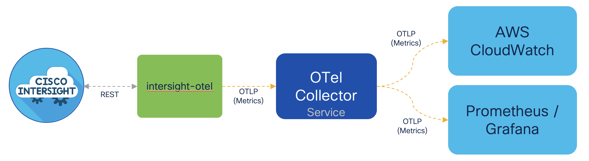
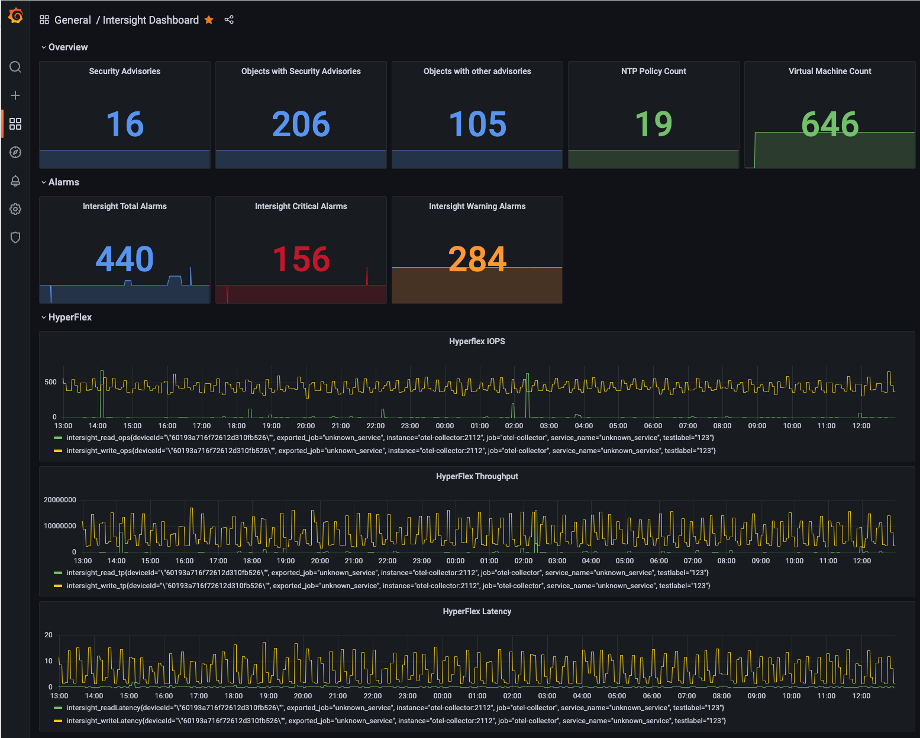
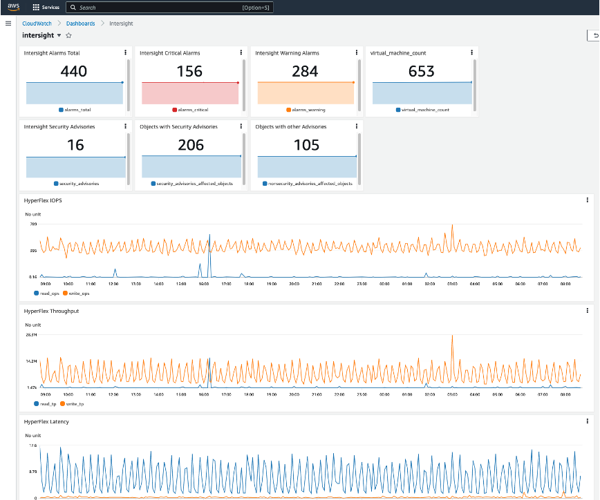
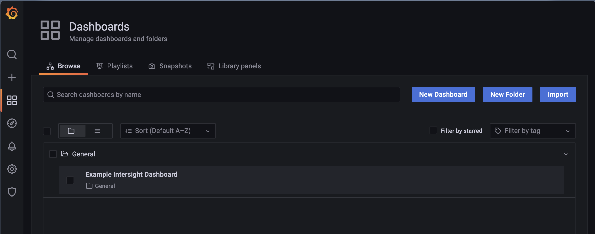

# intersight-otel - generate OpenTelemetry metrics from Cisco Intersight API calls

`intersight-otel` is a tool to make Cisco Intersight API requests and generate OpenTelemetry metrics from the responses. 

The use case for this is to feed statistics about an Intersight managed environment into other monitoring and dashboarding tools such as Prometheus/Grafana, AWS Cloudwatch, etc. By generate OpenTelemetry metrics, the [otel-collector](https://opentelemetry.io/docs/collector/) can be used to export the metrics into a variety of [different backends](https://github.com/open-telemetry/opentelemetry-collector-contrib/tree/main/exporter):







# Configuration

`intersight-otel` is configured via a TOML file (default: `intersight_otel.toml`). See `examples/intersight_otel.toml` for a full example.

## Top-level fields

| Field | Required | Description |
|-------|----------|-------------|
| `key_file` | Yes | Path to the Intersight API RSA private key PEM file |
| `key_id` | Yes | Intersight API key ID |
| `otel_collector_endpoint` | Yes | OTLP gRPC endpoint (e.g. `http://localhost:4317`) |
| `intersight_host` | No | Intersight hostname (default: `intersight.com`) |
| `intersight_accept_invalid_certs` | No | Skip TLS certificate verification (default: `false`) |

## Pollers (`[[pollers]]`)

Generic REST pollers make a single API call and aggregate the response into a gauge metric.

| Field | Required | Description |
|-------|----------|-------------|
| `name` | Yes | OTel metric name |
| `api_query` | Yes | Intersight API path (e.g. `api/v1/virtualization/VirtualMachines?$count=true`) |
| `aggregator` | Yes | `result_count` (reads the `Count` field) or `count_results` (counts items in `Results`) |
| `interval` | No | Poll interval in seconds (default: 10) |
| `otel_attributes` | No | Static OTel attributes to attach (inline table, e.g. `{ severity = "critical" }`) |
| `api_method` | No | HTTP method (default: `GET`) |
| `api_body` | No | Request body for POST requests |
| `enrichers` | No | List of enricher names to apply (e.g. `["server_profile"]`) |

## Timeseries pollers (`[[tspollers]]`)

Timeseries pollers query Intersight's Druid-based `GroupBys` endpoint for time-aggregated metrics.

| Field | Required | Description |
|-------|----------|-------------|
| `name` | Yes | Poller name (used in logs) |
| `datasource` | Yes | Druid datasource name |
| `dimensions` | Yes | Druid dimensions to group by |
| `field_names` | Yes | Fields to emit as OTel metrics |
| `aggregations` | No | Druid aggregations |
| `post_aggregations` | No | Druid post-aggregations |
| `otel_dimension_to_attribute_map` | No | Maps Druid dimension names to OTel attribute names |
| `otel_attributes` | No | Static OTel attributes to attach |
| `interval` | No | Poll interval in seconds (default: 10) |
| `enrichers` | No | List of enricher names to apply (e.g. `["server_profile"]`) |

## Attribute enrichers (`[[enrichers]]`)

Enrichers attach additional OTel attributes to metrics by making a secondary Intersight API lookup, keyed on an existing attribute value. Results are cached in memory to avoid redundant API calls.

| Field | Required | Description |
|-------|----------|-------------|
| `name` | Yes | Identifier referenced from pollers via `enrichers = ["name"]` |
| `source_attribute` | Yes | OTel attribute whose value is used as the lookup key |
| `source_value_regex` | No | Regex applied to the source attribute before lookup. If a capture group is present its value is used; otherwise the full match is used |
| `query_template` | Yes | Intersight API path with `{value}` substituted by the (optionally regex-extracted) source value |
| `result_mappings` | Yes | List of `{ result_field = "<JSONPath>", result_attribute = "<otel-attr-name>" }` mappings |

**Example** — attach the server profile name to UCS metrics:

```toml
[[tspollers]]
name = "ucs_hw_cpu_utilization"
datasource = "PhysicalEntities"
dimensions = ["host.name", "host.id"]
# ... other tspoller fields ...
enrichers = ["server_profile"]

[[enrichers]]
name = "server_profile"
source_attribute = "host.id"
# Extract the Moid from a path like "/api/v1/compute/Blades/<moid>"
source_value_regex = "[^/]+$"
query_template = "api/v1/server/Profiles?$filter=AssignedServer.Moid eq '{value}' or AssociatedServer.Moid eq '{value}'"
result_mappings = [
    { result_field = "$.Results[0].Name", result_attribute = "intersight.server_profile.name" },
]
```

# Usage

The simplest way to try `intersight-otel` is to deploy the example onto a Kubernetes cluster. This will deploy a preconfigured `intersight-otel` agent, a Prometheus server and a Grafana server. All you need to provide is your Intersight API key.

First, create a new namespace for the demo:
```
$ kubectl create namespace intersight-otel
namespace/intersight-otel created
```

Add your Intersight API key as a Kubernetes secret. This assumes you have your Intersight Key ID in `/tmp/intersight.keyid.txt` and your Intersight Key in `/tmp/intersight.pem`:
```
$ kubectl -n intersight-otel create secret generic intersight-api-credentials --from-file=intersight-key-id=/tmp/intersight.keyid.txt --from-file=intersight-key=/tmp/intersight.pem
secret/intersight-api-credentials created
```

Finally, apply the example manifest:
```
$ kubectl -n intersight-otel apply -f https://github.com/cgascoig/intersight-otel/raw/main/examples/kubernetes/all-in-one.yaml
deployment.apps/intersight-otel created
configmap/intersight-otel-config created
service/otel-collector created
configmap/otel-collector-config created
configmap/prometheus-config created
statefulset.apps/prometheus created
service/prometheus created
deployment.apps/grafana created
configmap/grafana-datasources created
configmap/grafana-dashboards-provider created
configmap/grafana-dashboards created
```

Wait for the services to start:
```
$ kubectl -n intersight-otel get pods
NAME                               READY   STATUS    RESTARTS   AGE
grafana-7bf5ff9cfd-bh4v7           1/1     Running   0          88s
intersight-otel-6b67b4d694-lhkwd   2/2     Running   0          88s
prometheus-0                       1/1     Running   0          88s
```

Setup a port forward to the Grafana dashboard:
```
$ kubectl -n intersight-otel port-forward deployments/grafana 3000
Forwarding from 127.0.0.1:3000 -> 3000
Forwarding from [::1]:3000 -> 3000
```

Now you can open the Grafana dashboard in your browser using the URL `http://localhost:3000/`. Login with the default username/password of admin/admin and then browse to Dashboards -> Browse:



Then Click on `Example Intersight Dashboard to see the example dashboard:

